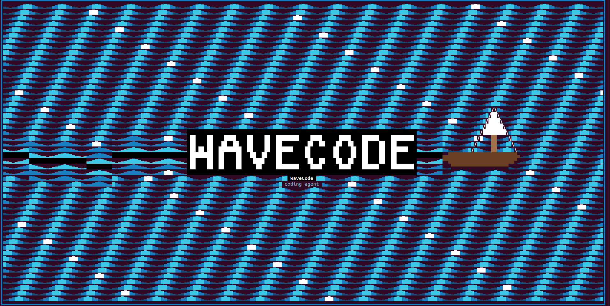
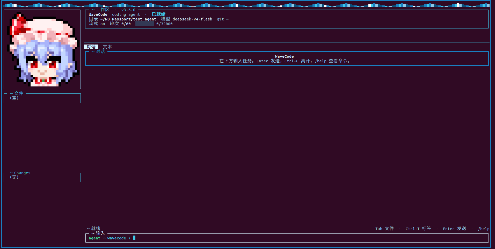

# WaveCode

WaveCode 是命令行编程智能体：用自然语言下达任务，经对话接口取得模型回复，在本地读写文件、搜索与执行命令，循环至任务完成。

界面为全屏终端（Rich）。默认模型 `deepseek-v4-flash`，可用配置切换。





设计规格见 [docs/](docs/README.md)。

## 安装

需要 Python 3.11+。

```bash
pip install .
# 开发
pip install -e ".[dev]"
```

```bash
export DEEPSEEK_API_KEY=...    # 或复制 .env.example 为 .env
```

可选：`DEEPSEEK_MODEL`、`WAVEMIO_WORKDIR`、`WAVEMIO_MAX_TURNS`。完整对照见 [docs/10-implementation-spec.md](docs/10-implementation-spec.md) §11。

## 功能

- **三种模式：** `ask` 只读问答；`plan` 逐问确认后写出内部计划；`agent` 落地改文件（默认）。
- **七个本地工具：** `read_file`、`list_dir`、`glob_search`、`grep`、`write_file`、`edit_file`、`bash`。ask / plan 仅只读四件。
- **Skill：** `/skill` 将 `SKILL.md` 装入本会话（最多 8 个）。发行包装有 `tdd`、`frontend-design`。
- **工作区：** 左轨文件树与 Changes；主区对话 / 文本标签；助手回复按 Markdown 渲染。
- **上下文：** 超预算时压缩较早轮次，保留近期对话。

## 使用

```bash
wavecode                              # 全屏界面（默认）
wavecode run "写一个 hello.py 并运行"
wavecode --workdir /path --mode plan
```
Enter 发送，行末 `\` 续行，Ctrl+C 离开。Tab 在输入、文件、Changes 间切换；F1 / F2 / Ctrl+T 切换对话与文本。

| 命令 | 作用 |
|------|------|
| `/help` | 命令说明 |
| `/mode` | ask / plan / agent |
| `/model` `/skill` `/mascot` | 模型、Skill、立绘 |
| `/setting` `/think` | 轮次、流式、thinking |
| `/undo` | 还原本任务的文件改写 |
| `/reset` `/quit` | 清空对话 / 退出 |

会话日志：`<workdir>/.wavecode/logs/`。

立绘包放在 `~/.wavecode/mascots/<名>/`（至少 `idle.gif` / `idle.png` / `idle.txt`）。Skill 放在 `~/.wavecode/skills/<名>/SKILL.md`。

## 开发

```bash
ruff check src tests
PYTEST_DISABLE_PLUGIN_AUTOLOAD=1 pytest
```
