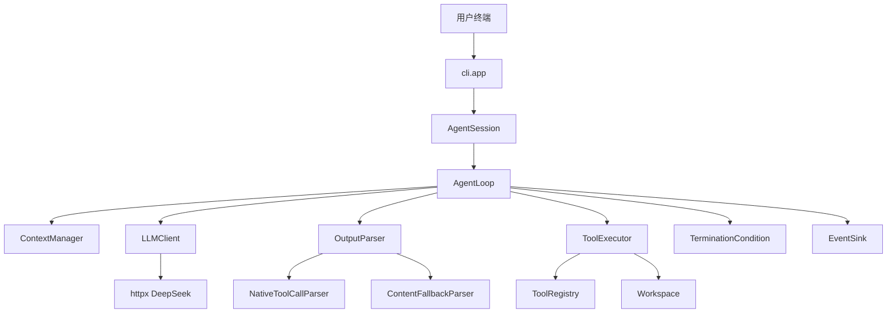
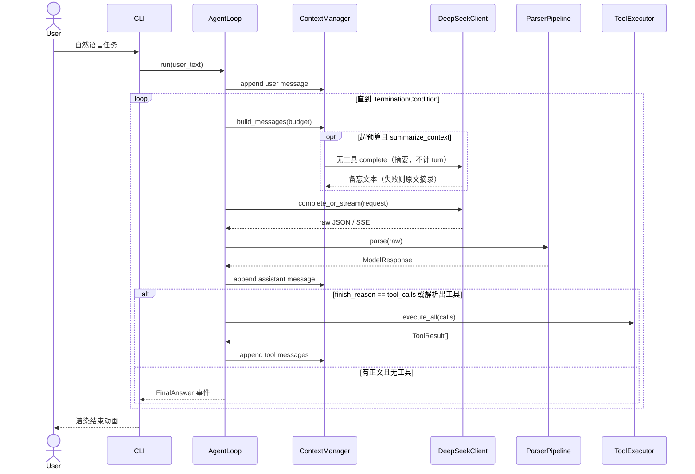

# 01 · 架构

## 1. 分层（严格单向依赖）

```
┌─────────────────────────────────────────────┐
│  Presentation   cli/  （Rich UI，可替换）     │
├─────────────────────────────────────────────┤
│  Application    agent/ session + loop        │
├─────────────────────────────────────────────┤
│  Domain         tools / context / parsing /  │
│                 termination / events         │
├─────────────────────────────────────────────┤
│  Infrastructure llm/deepseek  fs  subprocess │
└─────────────────────────────────────────────┘
```

依赖规则：

- **内层不得 import 外层**。`agent.loop` 不得 `import coding_agent.cli`。
- UI 通过 `EventSink` 协议接收事件；测试用 `RecordingSink`。
- 唯一允许跨层 new 具体实现的地方：`coding_agent.app.bootstrap`。

这样以后加 Web 前端或 HTTP 包装，不必改循环。

## 2. 逻辑视图



## 3. 一次用户任务的时序



## 4. 包结构（src layout）

```
src/coding_agent/
  app/           组合根、系统提示词
  config/        配置（pydantic-settings）
  domain/        与基础设施无关的消息/事件/结果类型
  errors/        异常谱系
  llm/           LLM 端口与 DeepSeek 适配器
  context/       历史与窗口策略（截断 + 可选模型摘要）
  skills/        SKILL.md 发现与本会话装载（不是工具）
  tools/         工具端口、注册、执行、沙箱、工具实现
  parsing/       输出解析管道
  termination/   终止条件
  agent/         循环与会话（应用层）
  cli/           主题、动画、REPL
```

测试镜像包结构：`tests/unit/...`、`tests/integration/`（integration 默认可 skip 网络）。

## 5. 使用的设计模式（以及为什么）

| 模式 | 用在哪 | 为什么（面试答辩） |
|------|--------|-------------------|
| 依赖倒置 / 端口-适配器 | `LLMClient`、`EventSink`、`TokenEstimator` | 循环不绑死 DeepSeek 或 Rich，可单测 |
| 策略 | `ContextPolicy`、`RetryPolicy`、`TerminationCondition` | 换策略不必改循环 |
| 组合 | `AnyOfTermination` 聚合多个条件 | 终止规则可叠加 |
| 模板方法 | `Tool.run`：校验 → 执行 → 包装结果 | 每个工具少写样板，错误形态统一 |
| 注册表 | `ToolRegistry` | 开闭：加工具不改循环 |
| 适配器 | `DeepSeekClient` 把 HTTP JSON 变成领域 `ModelResponse` | 解析逻辑可测 |
| 观察者（轻量） | `EventSink.on_event` | UI 与循环解耦 |
| 工厂 | `build_default_registry()`、`build_agent()` | 组合根集中创建 |
| 责任链 | `ParserPipeline` 原生解析失败再走兜底 | 模型偶发把工具写进 content |

**禁止** 使用单例保存 Settings / Client。一律构造注入。

## 6. 运行时对象图（一次 REPL 会话）

`build_agent()` 创建并注入：

- `Settings`（只创建一次）
- `Workspace(root)`
- `ToolRegistry` + 7 个 Tool
- `ToolExecutor`
- `HeuristicTokenEstimator`
- `TruncatingContextPolicy`，默认再包一层 `SummarizingContextPolicy`
- `SkillBank`（发现发行包 `skills/packs`、`~/.wavecode/skills` 与工作区 `.wavecode/skills`）
- `ContextManager`（每个 Session 一个；REPL 多轮任务共享同一 Session 历史，one-shot 用新 Session）
- `DeepSeekClient(httpx.Client)`
- `ParserPipeline`
- `AnyOfTermination(...)`
- `AgentLoop`
- `RichEventSink`
- `AgentSession`

REPL 中用户连续提问：默认 **同一 Session**（模型能看见上一题改过的文件上下文）。提供 `/reset` 清空历史但保留 Workspace。

## 7. 配置与密钥流

```
进程启动
  → load_dotenv() 仅当文件存在且未被 git 跟踪预期
  → Settings() 从环境变量读取
  → 若 api_key 为空：CLI 打印红色说明并 exit 2，不发起网络
  → httpx.Client(headers Authorization Bearer)
  → 日志过滤器把 Bearer 换成 ***
```

Settings 字段见 `10-implementation-spec.md`。默认模型 `deepseek-v4-flash`，`thinking.type=disabled`。`--think` 打开 thinking。打开后 **回灌 assistant 消息时必须带上 `reasoning_content`**（DeepSeek thinking + tools 的官方要求，见其 Tool Calls / Thinking 文档）。

## 8. 与「后端服务」的关系

题目要的是 agent 循环这个**后端逻辑**，不是独立微服务。V1：

- CLI 线程/主线程直接 `await` 或同步调用 `AgentLoop.run`
- 循环是纯同步（`httpx.Client` 同步）。动画用 Rich `Live` 在主线程刷新。
- 若以后做服务：把 `AgentSession` 放到 FastAPI 即可，循环代码不动。

不要在 V1 引入 asyncio 除非实现者能保证 Rich Live 与 httpx 不打架。**指定 V1 全同步**，降低复杂度。

## 9. 并发模型

- 一轮内多个 `tool_calls`：**默认串行**执行（文件工具有顺序依赖，例如先 write 再 bash）。
- 配置 `tools.parallel=true` 时，仅当所有 call 的 `name` 属于只读集合 `{read_file, list_dir, glob_search, grep}` 才用 `ThreadPoolExecutor` 并行；只要出现写工具或 bash，整批串行。
- V1 默认 `parallel=false`，但接口要留出来。

## 10. 模块禁止事项

| 禁止 | 原因 |
|------|------|
| 在 `tools/` 里调用 DeepSeek | 工具必须是纯本地副作用 |
| 在 `cli/` 里拼 messages | 拼装属于 ContextManager |
| 在 `DeepSeekClient` 里执行工具 | 那会变成「SDK 式 agent」，违反题目 |
| 循环里 `json.loads` 散落 | 解析必须走 Parser |
| 工具里 `print` | 只返回 `ToolResult`，由 Sink 渲染 |
