# 02 · 类设计（抽象、继承、数据）

本文给出 V1 **必须实现** 的类型。方法签名视为契约：测试会按这些名字写。模块路径相对于 `src/coding_agent/`。

约定：

- 抽象基类用 `abc.ABC`。
- 仅有一个方法的「端口」可用 `typing.Protocol`（运行时不强制继承）。
- 不可变数据用 `@dataclass(frozen=True, slots=True)`。
- 枚举用 `enum.StrEnum`。

---

## 1. 异常谱系 `errors/hierarchy.py`

```
AgentError(Exception)
├── ConfigError
├── CancelledError          # Ctrl+C / /quit 在循环内
├── LLMError
│   ├── LLMAuthError        # 401/403，不重试
│   ├── LLMRateLimitError   # 429，重试
│   ├── LLMTimeoutError     # 网络超时，重试
│   ├── LLMUnavailableError # 5xx / 网络断开，重试
│   └── LLMBadResponseError # HTTP 200 但 JSON 结构非法
├── ParseError
│   ├── EmptyResponseError
│   ├── ToolCallParseError
│   └── SchemaValidationError
└── ToolError               # 仅用于编程错误；业务失败走 ToolResult.ok=False
    ├── UnknownToolError
    ├── ToolPathError
    └── ToolTimeoutError
```

`ToolError` 的子类若在 `Tool.run` 内抛出，由 `ToolExecutor` 捕获并转为失败 `ToolResult`，**不得**冲出循环（见 08）。  
`UnknownToolError` 同样转为失败 Observation：「没有这个工具」。

---

## 2. 领域数据 `domain/`

### 2.1 `domain/messages.py`

```python
class Role(StrEnum):
    SYSTEM = "system"
    USER = "user"
    ASSISTANT = "assistant"
    TOOL = "tool"

@dataclass(frozen=True, slots=True)
class ToolCallRequest:
    id: str                 # 来自 API 的 tool_call id；兜底解析时由我们生成 call_xxxxxxxx
    name: str
    arguments_json: str     # 原始 JSON 字符串，保留以便回灌 assistant 消息

@dataclass(frozen=True, slots=True)
class ChatMessage:
    role: Role
    content: str | None = None
    reasoning_content: str | None = None   # thinking 模式
    name: str | None = None
    tool_call_id: str | None = None        # role=tool
    tool_calls: tuple[ToolCallRequest, ...] = ()
```

不变量：

- `role=tool` ⇒ `tool_call_id` 非空，`tool_calls` 为空。
- `role=assistant` 且将执行工具 ⇒ `tool_calls` 非空；`content` 可为 None 或旁白。
- 回灌 HTTP 时由 `DeepSeekClient._to_api_messages` 转换，**不要**在循环里手搓 dict。

### 2.2 `domain/results.py`

```python
@dataclass(frozen=True, slots=True)
class ToolResult:
    tool_call_id: str
    name: str
    ok: bool
    content: str            # 给模型看的文本，必须是 str
    meta: Mapping[str, str] # 给 UI：elapsed_ms, path 等，不进模型上下文除非拼进 content
```

### 2.3 `domain/events.py`

```python
@dataclass(frozen=True, slots=True)
class AgentEvent:
    ts: float               # time.time()

# 具体事件（全部 frozen dataclass，继承 AgentEvent）：
class SessionStarted(AgentEvent): ...
class UserMessageAccepted(AgentEvent):
    text: str

class TurnStarted(AgentEvent):
    turn: int

class LLMRequestStarted(AgentEvent): ...
class ReasoningDelta(AgentEvent):
    text: str
class ContentDelta(AgentEvent):
    text: str
class LLMRequestFinished(AgentEvent):
    finish_reason: str
    usage: TokenUsage | None

class ToolCallScheduled(AgentEvent):
    call: ToolCallRequest
class ToolExecutionStarted(AgentEvent):
    call: ToolCallRequest
class ToolExecutionFinished(AgentEvent):
    result: ToolResult

class ContextCompacted(AgentEvent):
    before_tokens: int
    after_tokens: int
    note: str

class TurnFinished(AgentEvent):
    turn: int

class FinalAnswer(AgentEvent):
    text: str
    reason: str             # termination reason 名

class AgentWarned(AgentEvent):
    message: str
class AgentFailed(AgentEvent):
    message: str
    cause: str
class SessionEnded(AgentEvent):
    reason: str
```

### 2.4 `EventSink` 协议 `domain/ports.py`

```python
class EventSink(Protocol):
    def on_event(self, event: AgentEvent) -> None: ...
```

另提供 `NullSink`、`FanoutSink(list[EventSink])`（日志 + UI）。

---

## 3. LLM 端口 `llm/`

### 3.1 `llm/types.py`

```python
class FinishReason(StrEnum):
    STOP = "stop"
    LENGTH = "length"
    TOOL_CALLS = "tool_calls"
    CONTENT_FILTER = "content_filter"
    INSUFFICIENT = "insufficient_system_resource"
    UNKNOWN = "unknown"

@dataclass(frozen=True, slots=True)
class TokenUsage:
    prompt_tokens: int
    completion_tokens: int
    total_tokens: int
    reasoning_tokens: int = 0
    cache_hit_tokens: int = 0

@dataclass(frozen=True, slots=True)
class ModelRequest:
    messages: Sequence[ChatMessage]
    tools: Sequence[Mapping[str, Any]]   # OpenAI 形状的 tools JSON
    model: str
    temperature: float
    max_tokens: int
    tool_choice: str | Mapping[str, Any] = "auto"
    stream: bool = True
    thinking_enabled: bool = False
    reasoning_effort: str = "high"       # 仅 thinking 时发送

@dataclass(frozen=True, slots=True)
class ModelResponse:
    message: ChatMessage                 # assistant
    finish_reason: FinishReason
    usage: TokenUsage | None
    raw: Mapping[str, Any]               # 原始 JSON，调试用，不得打印密钥
```

### 3.2 `llm/client.py`

```python
class LLMClient(ABC):
    @abstractmethod
    def complete(self, request: ModelRequest) -> ModelResponse:
        """非流式。stream=True 的请求也必须能走 stream()。"""

    @abstractmethod
    def stream(self, request: ModelRequest, sink: EventSink) -> ModelResponse:
        """SSE；边收边发 ReasoningDelta/ContentDelta；返回拼好的 ModelResponse。"""
```

V1 循环 **优先 `stream()`**；若 `Settings.stream=False` 则 `complete()`。

### 3.3 `llm/retry.py`

```python
class RetryPolicy(ABC):
    @abstractmethod
    def should_retry(self, exc: BaseException, attempt: int) -> bool: ...
    @abstractmethod
    def sleep_seconds(self, attempt: int) -> float: ...

class ExponentialBackoffRetry(RetryPolicy):
    def __init__(self, max_attempts: int = 4, base: float = 0.8, cap: float = 8.0): ...
```

可重试：`LLMTimeoutError`、`LLMRateLimitError`、`LLMUnavailableError`。  
不可重试：`LLMAuthError`、`ConfigError`、`LLMBadResponseError`（结构坏了重试也没用，除非 200 体为空则可再试一次）。

装饰由 `DeepSeekClient` 内部调用，不要散落在 Loop。

### 3.4 `llm/deepseek.py` — `DeepSeekClient(LLMClient)`

职责：

1. 把 `ModelRequest` 序列化为官方 JSON。仅当目录判定该模型支持 thinking 时才带 `thinking: {type: enabled|disabled}`。
2. HTTP：`httpx.Client`，timeout 可配。
3. 状态码映射到异常谱系。
4. 非流式：`response.json()` → `parse_chat_completion(dict) -> ModelResponse`。
5. 流式：解析 `data: {...}` 行，忽略 `data: [DONE]`，用 `StreamAssembler` 拼 `tool_calls` 增量。
6. 可选（不在 `LLMClient` ABC 上）：`set_model`、`list_model_ids`（`GET {base}/models`），供 `/model` 使用。`llm/catalog.py` 只列文本模型 id（过滤 `vision`），接口 id 不改写成 V4。

**本类不得执行工具、不得修改 ConversationStore。**

### 3.5 `llm/stream.py` — `StreamAssembler`

维护：

- `content` 缓冲
- `reasoning_content` 缓冲
- `tool_calls`：按 index 增长的 `{id, name, arguments}` 字符串拼接
- 最后的 `finish_reason`、`usage`

`feed(delta_dict) -> None`  
`finish() -> ModelResponse`

---

## 4. 工具系统 `tools/`

### 4.1 `tools/base.py`

```python
@dataclass(frozen=True, slots=True)
class ToolContext:
    workspace: Workspace
    timeout_s: float

class Tool(ABC):
    name: str                       # 类属性，[a-z0-9_]{1,64}
    description: str
    parameters: ClassVar[dict]      # JSON Schema object

    def schema(self) -> dict:
        """返回 OpenAI tools[] 里的一个 function 元素。"""

    def validate_args(self, arguments_json: str) -> Mapping[str, Any]:
        """json 解析 + jsonschema 子集校验，失败抛 SchemaValidationError。"""

    def run(self, call: ToolCallRequest, ctx: ToolContext) -> ToolResult:
        """模板方法：validate → execute → 截断过长输出 → ToolResult。"""

    @abstractmethod
    def execute(self, args: Mapping[str, Any], ctx: ToolContext) -> str:
        """只返回给模型看的字符串；失败应抛 ToolError 或返回错误描述。
        推荐抛 ToolError 让 run() 统一包装。"""
```

`schema()` 形状：

```json
{
  "type": "function",
  "function": {
    "name": "...",
    "description": "...",
    "parameters": { "type": "object", "properties": {}, "required": [] }
  }
}
```

V1 不发 `strict: true`。

### 4.2 `tools/workspace.py` — `Workspace`

```python
class Workspace:
    def __init__(self, root: Path):
        self.root = root.resolve()

    def resolve(self, user_path: str) -> Path:
        """相对 root；禁止逃逸；绝对路径仅当仍位于 root 下。"""

    def relpath(self, path: Path) -> str: ...
    def mark_new_task(self) -> None:
        """下一次 remember 开启新的 /undo 窗口。"""
    def remember(self, path: Path) -> None:
        """write_file / edit_file 改盘前快照；同一窗口同一路径只记第一次。"""
    def restore_task_files(self) -> list[str]:
        """按快照还原并清空窗口。新建文件删除。"""
```

逃逸判定：`(root / user_path).resolve()` 的 `relative_to(root)` 失败则 `ToolPathError`。  
符号链接：resolve 后仍须在 root 内。

### 4.3 `tools/registry.py` — `ToolRegistry`

```python
class ToolRegistry:
    def register(self, tool: Tool) -> None: ...
    def get(self, name: str) -> Tool: ...          # 找不到 UnknownToolError
    def schemas(self) -> list[dict]: ...
    def names(self) -> tuple[str, ...]: ...
```

重复注册同名：抛 `ConfigError`（启动期失败，不要静默覆盖）。

### 4.4 `tools/executor.py` — `ToolExecutor`

```python
class ToolExecutor:
    def execute_one(self, call: ToolCallRequest, sink: EventSink) -> ToolResult: ...
    def execute_all(self, calls: Sequence[ToolCallRequest], sink: EventSink) -> list[ToolResult]: ...
```

`execute_one` 必须：

1. `ToolExecutionStarted`
2. 查表、执行、计时
3. 任何异常 → 失败 `ToolResult`（content 为错误信息）
4. `ToolExecutionFinished`

未知工具、非法 JSON、路径逃逸、超时，全部是失败 Result，循环继续。

---

## 5. 上下文 `context/`

### 5.1 `context/estimator.py`

```python
class TokenEstimator(ABC):
    @abstractmethod
    def estimate_message(self, message: ChatMessage) -> int: ...
    @abstractmethod
    def estimate_messages(self, messages: Sequence[ChatMessage]) -> int: ...
    @abstractmethod
    def estimate_tools(self, schemas: Sequence[Mapping[str, Any]]) -> int: ...
```

`HeuristicTokenEstimator`：ASCII 按 4 chars/token，CJK 按 1.5 chars/token，另加每条消息 8 token 开销。  
`UsageCalibratingEstimator`（可选包装）：记住上次 API `prompt_tokens / 估计值` 的比率，夹在 `[0.6, 1.8]`。V1 建议实现简单校准，没有历史比率时用 1.0。

### 5.2 `context/store.py` — `ConversationStore`

```python
class ConversationStore:
    def __init__(self, system: ChatMessage): ...
    def append(self, message: ChatMessage) -> None: ...
    def all(self) -> tuple[ChatMessage, ...]: ...     # 含 system
    def reset_keeping_system(self) -> None: ...
    def replace_tail_view(self, view: Sequence[ChatMessage]) -> None:
        """仅 ContextManager 在压缩后写回；system 必须仍是第一条。"""
    def replace_system(self, system: ChatMessage) -> None:
        """/skill 重建 system 时用：替换 index 0，其余消息不动。"""
```

### 5.3 `context/policy.py`

```python
class ContextPolicy(ABC):
    @abstractmethod
    def compact(
        self,
        messages: Sequence[ChatMessage],
        *,
        budget: int,
        estimator: TokenEstimator,
        tool_schemas: Sequence[Mapping[str, Any]],
    ) -> tuple[list[ChatMessage], str]:
        """返回 (可发送列表, 人类可读 note)。不得丢掉 system。"""
```

实现 `TruncatingContextPolicy`（窗口 + 截断 + 原文摘录兜底，见 04 §4）与 `SummarizingContextPolicy`（先窗口，再对 dropped 块做模型摘要，见 04 §4.2）。  
`SummarizingContextPolicy(inner: TruncatingContextPolicy, summarizer: ConversationSummarizer)` 为 bootstrap **默认**接线。`summarize_context=false` 时只接 inner。

```python
class ConversationSummarizer(Protocol):
    def summarize(
        self,
        *,
        dropped: Sequence[ChatMessage],
        previous_summary: str | None,
    ) -> str: ...
```

### 5.4 `context/manager.py` — `ContextManager`

```python
class ContextManager:
    def append(self, message: ChatMessage) -> None: ...
    def build_request_messages(
        self, tool_schemas: Sequence[Mapping[str, Any]]
    ) -> tuple[list[ChatMessage], int, str | None]:
        """应用 policy；返回 messages, estimated_tokens, compaction_note|None"""
    def observe_usage(self, usage: TokenUsage) -> None: ...
    def store(self) -> ConversationStore: ...
```

---

## 6. 解析 `parsing/`

```python
class OutputParser(ABC):
    @abstractmethod
    def parse(self, response: ModelResponse) -> ModelResponse:
        """可enriched：例如从 content 抽出工具。解析失败抛 ParseError。"""

class NativeToolCallParser(OutputParser): ...
class ContentFallbackParser(OutputParser): ...
class ParserPipeline(OutputParser):
    def __init__(self, parsers: Sequence[OutputParser]): ...
```

`json_repair.py`：`repair_json_object(text: str) -> str`，处理尾逗号、单引号、```json 围栏。不是完整 JSON5；失败抛 `ToolCallParseError`。

详细算法见 06。

---

## 7. 终止 `termination/`

```python
@dataclass(frozen=True, slots=True)
class TerminationDecision:
    stop: bool
    reason: str             # 短标识符，如 max_turns
    message: str            # 给用户看

class LoopView(Protocol):
    @property
    def turn(self) -> int: ...
    @property
    def consecutive_llm_failures(self) -> int: ...
    @property
    def last_response(self) -> ModelResponse | None: ...
    @property
    def last_parsed_had_tools(self) -> bool: ...
    @property
    def last_assistant_text(self) -> str: ...
    @property
    def started_at(self) -> float: ...
    @property
    def estimated_prompt_tokens(self) -> int: ...
    @property
    def cancelled(self) -> bool: ...

class TerminationCondition(ABC):
    @abstractmethod
    def evaluate(self, view: LoopView) -> TerminationDecision: ...

class AnyOfTermination(TerminationCondition):
    """第一个 stop=True 的子条件胜出。"""
```

具体条件类见 07。循环在 **每轮模型调用之前** 以及 **每轮工具执行之后** 各 evaluate 一次。

---

## 8. 应用层 `agent/`

### 8.1 `agent/state.py` — `LoopState`

可变状态，实现 `LoopView`。字段与 07 对齐。提供 `cancel()`。

### 8.2 `agent/loop.py` — `AgentLoop`

```python
class AgentLoop:
    def __init__(
        self,
        *,
        llm: LLMClient,
        context: ContextManager,
        executor: ToolExecutor,
        registry: ToolRegistry,
        parser: OutputParser,
        termination: TerminationCondition,
        settings: Settings,
        sink: EventSink,
    ): ...

    def run(self, user_text: str) -> str:
        """阻塞直到终止；返回最终给用户的文本（可能是失败说明）。"""
```

算法见 03。本类是编排器，**不含** HTTP/文件细节。

### 8.3 `agent/session.py` — `AgentSession`

```python
class AgentSession:
    plan_document: str = ""  # plan 模式产出的内部 # 计划 文档

    def __init__(self, loop: AgentLoop, context: ContextManager, sink: EventSink): ...
    def ask(self, user_text: str) -> str: ...
    def reset(self) -> None: ...
    def rebuild_system(self) -> None:
        """按当前 SkillBank、mode、plan_document 重写 system，不清对话。"""
```

REPL 持有一个 Session。

---

## 9. CLI `cli/`

| 类 | 职责 |
|----|------|
| `Theme` | Rich Theme 与调色常量（`ui.*`） |
| `HalfBlockRenderer` | 像素网格 → 真彩色半块 `▀` |
| `SpriteBank` / `FramePlayer` | 鲸鱼娘帧缓存 |
| `WhalechanAnimator` | Live 换帧；禁止 ASCII 猫 |
| `RichEventSink` | Event → 终端 |
| `Repl` | 提示符、斜杠命令 |
| `SkillBank` | 见 13；实现在 `coding_agent.skills`，CLI 只做 `/skill` 分发 |
| `build_parser()` | argparse |
| `branding.py` | `PRODUCT_NAME = "Wavemio"` / `CLI_NAME = "wavemio"` 唯一来源 |

CLI 不 new DeepSeekClient，只调 `bootstrap.build_session()`。

---

## 10. 配置 `config/settings.py`

```python
class Settings(BaseSettings):
    model_config = SettingsConfigDict(
        env_file=".env",
        extra="ignore",
        env_prefix="WAVEMIO_",
        env_nested_delimiter="__",
    )

    deepseek_api_key: str = Field(validation_alias="DEEPSEEK_API_KEY", default="")
    deepseek_base_url: str = Field(
        default="https://api.deepseek.com",
        validation_alias="DEEPSEEK_BASE_URL",
    )
    deepseek_model: str = Field(
        default="deepseek-v4-flash",
        validation_alias="DEEPSEEK_MODEL",
    )

    workdir: Path = Field(default_factory=Path.cwd)
    mode: Literal["ask", "plan", "agent"] = "agent"
    stream: bool = True
    thinking: bool = False
    temperature: float = 0.2
    max_tokens: int = 4096
    max_turns: int = 60
    max_consecutive_failures: int = 3
    max_wallclock_s: float = 600
    max_context_tokens: int = 32000
    completion_reserve_tokens: int = 4096
    tool_output_max_chars: int = 80_000
    bash_timeout_s: float = 60
    http_timeout_s: float = 120
    parallel_readonly_tools: bool = False
    log_dir: Path = Path(".wavemio/logs")
    ascii_fallback: bool = False  # WAVEMIO_ASCII
    summarize_context: bool = True  # WAVEMIO_SUMMARIZE_CONTEXT
```

DeepSeek 三项用显式 alias，不受 `WAVEMIO_` 前缀影响。其余字段读 `WAVEMIO_WORKDIR` 等。

`api_key` 用 `repr` 定制？更稳妥：`Field(repr=False)`，并覆盖 `__str__` 不打印 key。

---

## 11. 组合根 `app/bootstrap.py`

```python
def build_session(settings: Settings, sink: EventSink) -> AgentSession: ...
def load_settings() -> Settings: ...
```

`if __name__` 不放这里；入口是 `cli/app.py` 与 `__main__.py`。

---

## 12. 继承总图

```mermaid
classDiagram
  class LLMClient {
    <<abstract>>
    complete()
    stream()
  }
  class DeepSeekClient
  LLMClient <|-- DeepSeekClient

  class Tool {
    <<abstract>>
    run()
    execute()
  }
  Tool <|-- ReadFileTool
  Tool <|-- WriteFileTool
  Tool <|-- EditFileTool
  Tool <|-- ListDirTool
  Tool <|-- GlobSearchTool
  Tool <|-- GrepTool
  Tool <|-- BashTool

  class OutputParser {
    <<abstract>>
    parse()
  }
  OutputParser <|-- NativeToolCallParser
  OutputParser <|-- ContentFallbackParser
  OutputParser <|-- ParserPipeline

  class TerminationCondition {
    <<abstract>>
    evaluate()
  }
  TerminationCondition <|-- AnyOfTermination
  TerminationCondition <|-- MaxTurnsCondition
  TerminationCondition <|-- NaturalCompletionCondition
  TerminationCondition <|-- ConsecutiveFailureCondition
  TerminationCondition <|-- CancelledCondition
  TerminationCondition <|-- WallClockCondition
  TerminationCondition <|-- ContextOverflowCondition

  class ContextPolicy {
    <<abstract>>
    compact()
  }
  ContextPolicy <|-- TruncatingContextPolicy
  ContextPolicy <|-- SummarizingContextPolicy

  class EventSink {
    <<protocol>>
  }
  EventSink <|.. RichEventSink
  EventSink <|.. JsonlLogSink
  EventSink <|.. FanoutSink

  class HalfBlockRenderer
  class WhalechanAnimator
  RichEventSink --> WhalechanAnimator
  WhalechanAnimator --> HalfBlockRenderer
```



## 13. 测试替身（必须提供）

| 类 | 用途 |
|----|------|
| `FakeLLMClient` | 按脚本返回预置 `ModelResponse` 序列 |
| `RecordingSink` | 记录事件列表 |
| `tmp_path` Workspace | pytest 临时目录 |

没有 FakeLLM，禁止用真实 API 作为单元测试。
